# 👋 Hi, I'm Fitria!

🎓 Computer Science Student | 💻 Tech & UI/UX Enthusiast

I'm passionate about building skills in **programming, UI/UX design, data analysis, and AI-assisted workflows**. I enjoy learning in public and continuously improving through personal projects.

## 📌 Interests

- 🌐 Web Development
- 📱 Mobile App Development
- 🎨 UI/UX Design
- 📊 Data Analysis
- 🤖 AI for Productivity
- 📚 Continuous Learning

---

# 🛠️ Tech Stack

## 👨‍💻 Programming Languages

<a href="https://isocpp.org/" target="_blank">
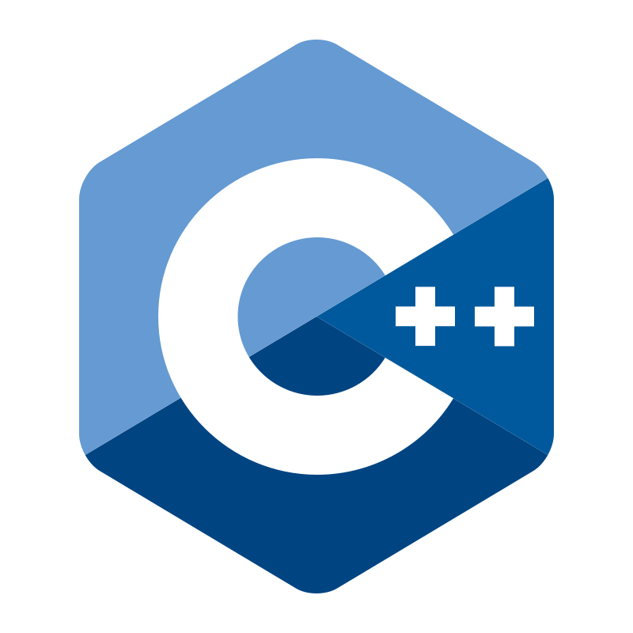
</a>

<a href="https://www.mysql.com/" target="_blank">
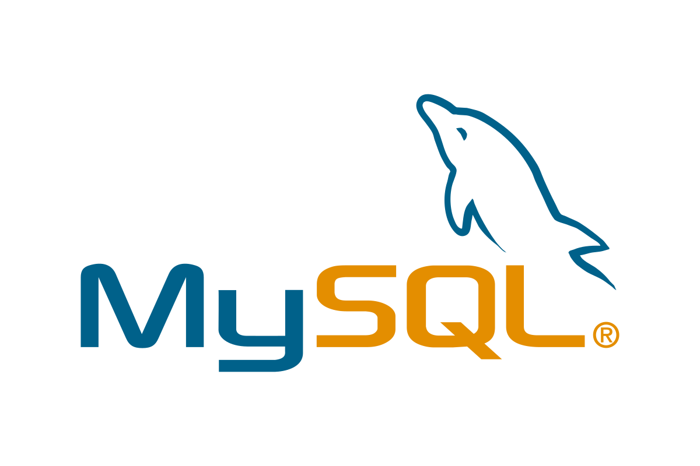
</a>

<a href="https://developer.mozilla.org/docs/Web/JavaScript" target="_blank">
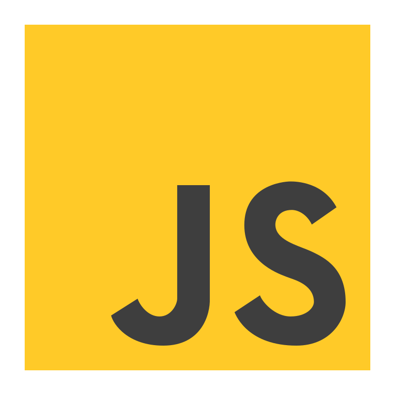
</a>

## 🧰 Development Tools

<a href="https://notepad-plus-plus.org/" target="_blank">
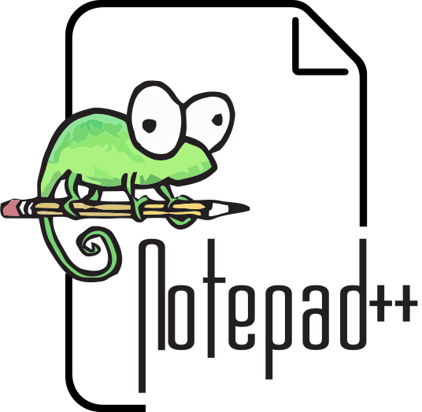
</a>

<a href="https://www.apachefriends.org/" target="_blank">
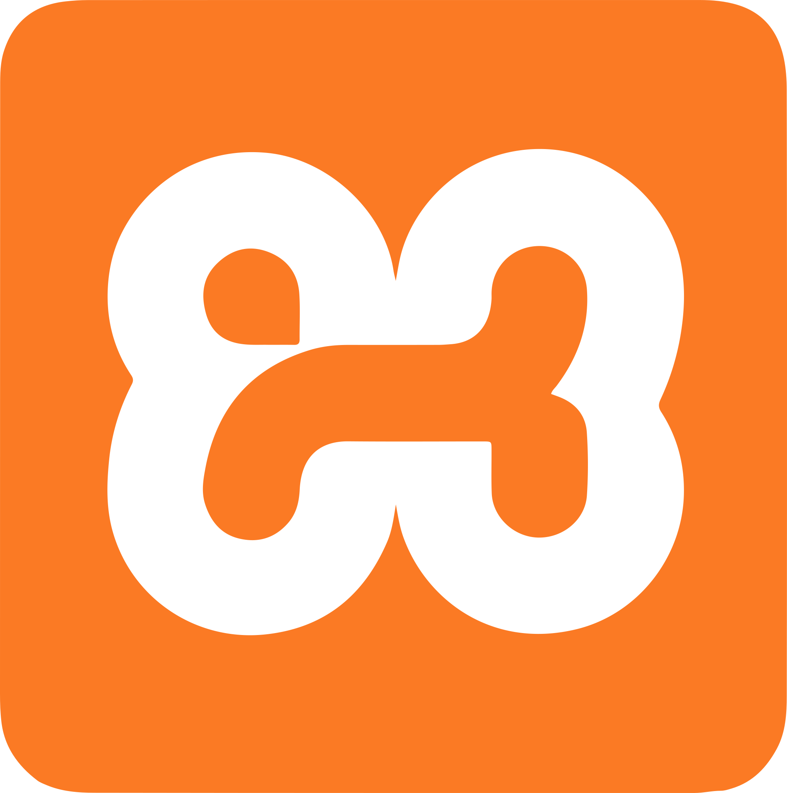
</a>

<a href="https://laragon.org/" target="_blank">
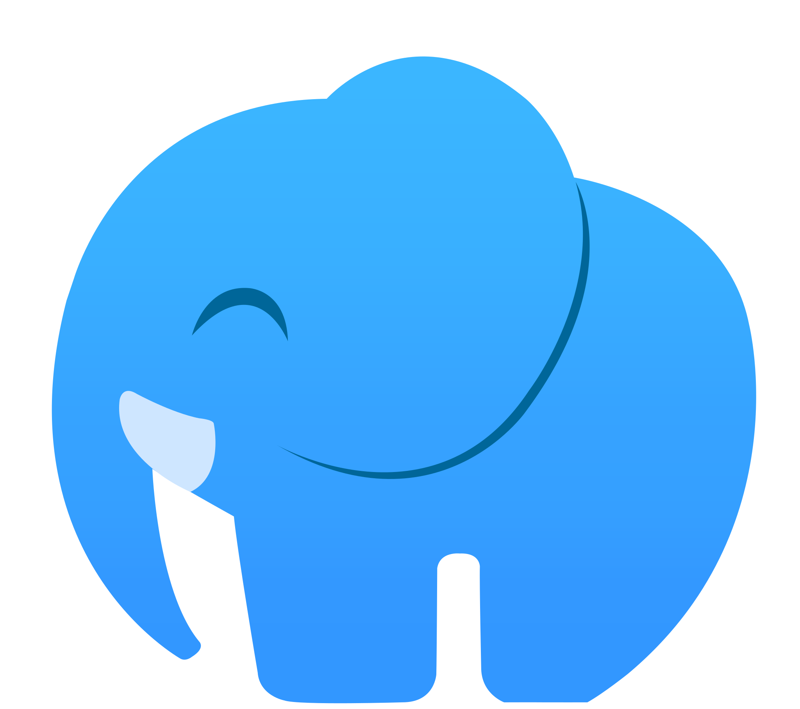
</a>

<a href="https://git-scm.com/" target="_blank">
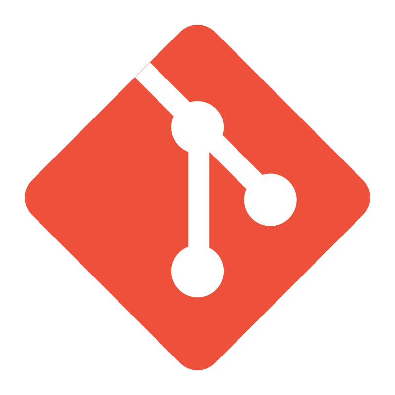
</a>

## 🤖 AI Tools

<a href="https://www.deepseek.com/" target="_blank">
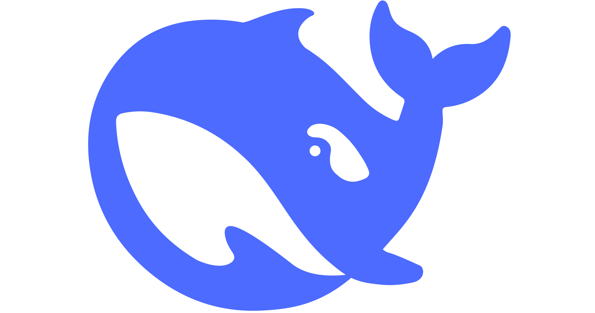
</a>

## 📝 Notes & Productivity

<a href="https://obsidian.md/" target="_blank">
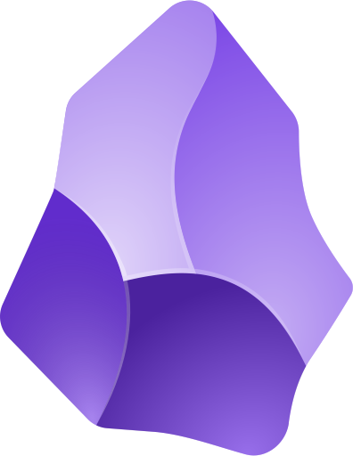
</a>

<a href="https://keep.google.com/" target="_blank">
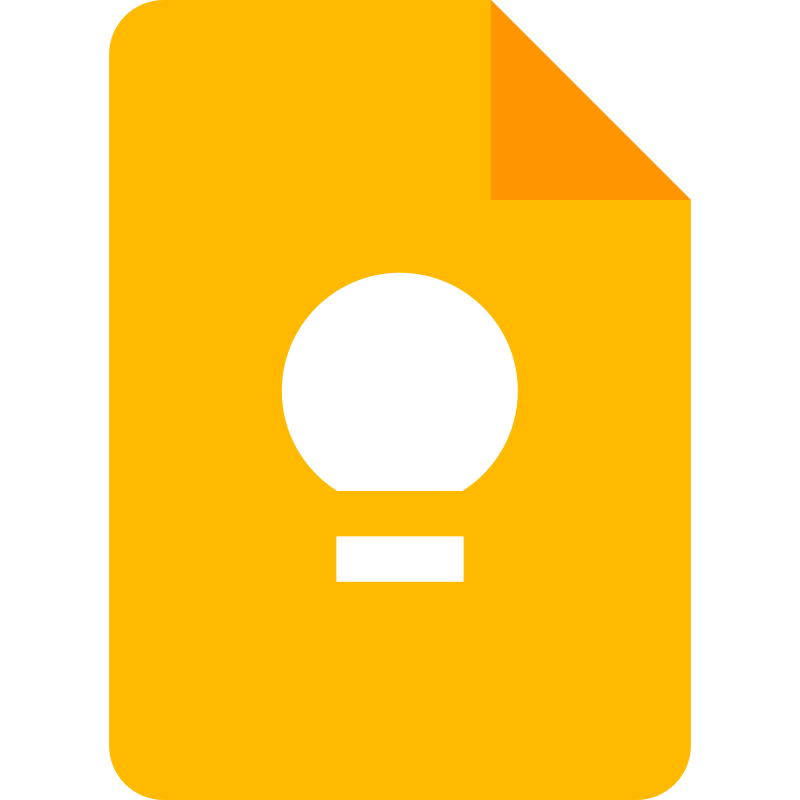
</a>

## 🎨 Design Tools

<a href="https://www.adobe.com/products/photoshop.html" target="_blank">
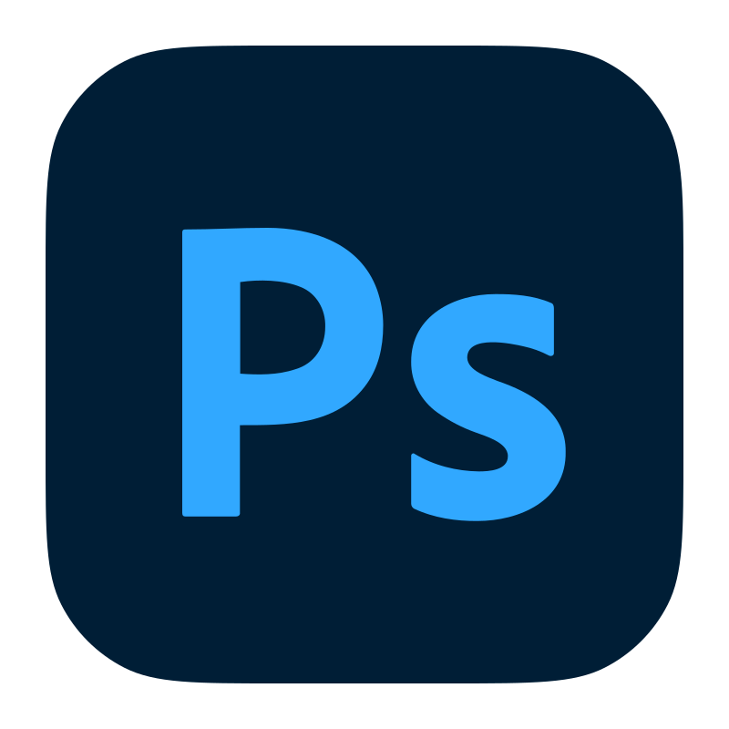
</a>

<a href="https://www.adobe.com/products/illustrator.html" target="_blank">
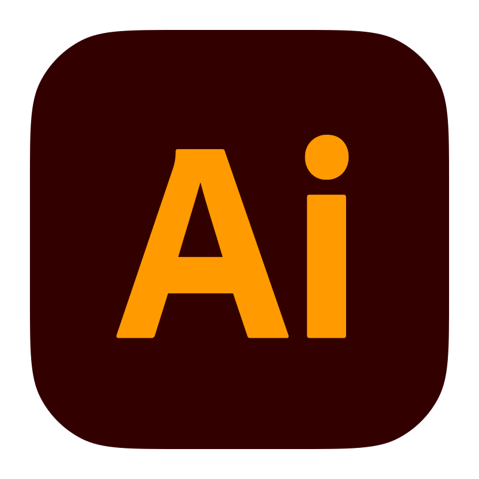
</a>

---

# 🔗 Let's Connect

<a href="mailto:fitrialm26@gmail.com">
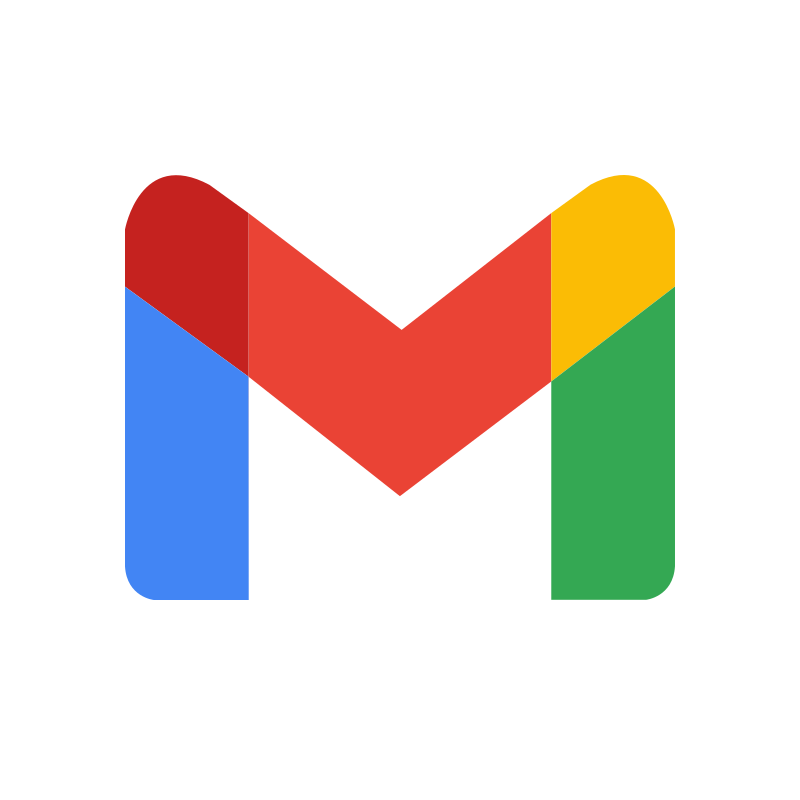
</a>

Explore my repositories to see my learning journey. 
Learning in public, one commit at a time ✨
